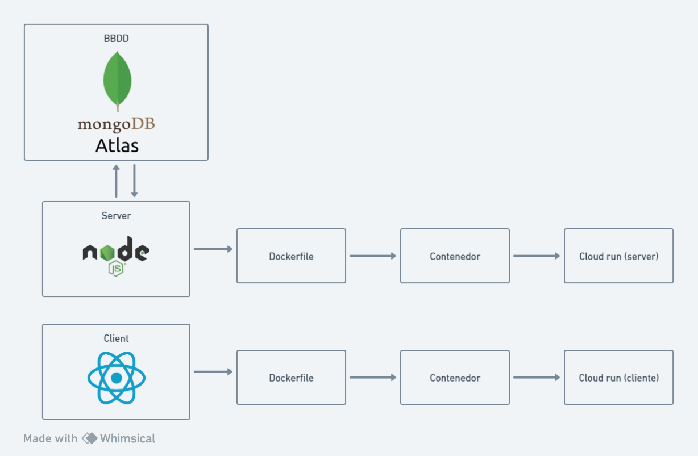
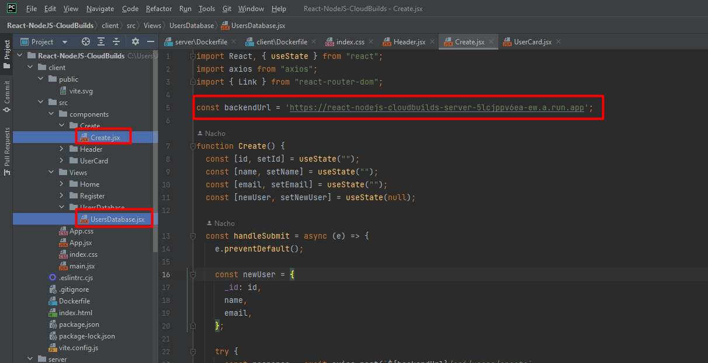

# React NodeJS Cloud Builds

El siguiente proyecto detalla los pasos para levantar una app con front-end en react y back-end en nodejs.   
Además integra el despliegue automático del cliente y el servidor en Cloud Run a través de Cloud Build. 



## Creación de usuarios con MERN Full Stack

Este es un proyecto construido utilizando la pila MERN Full Stack, que incluye MongoDB, Express, React y Node.js. 
MongoDB se utiliza como la base de datos y Mongoose se utiliza para interactuar con ella. 
Mongoose proporciona una interfaz simple y fácil de usar para realizar operaciones CRUD en la base de datos.

El proyecto consta de las siguientes vistas:


- **Home**:En la vista de Home, los usuarios tienen la opción de acceder a una de las siguientes funcionalidades:
    - Registro de usuario: Los usuarios pueden acceder a un formulario de registro para crear nuevas cuentas de usuario 
    en la aplicación.
    - Base de Datos: Los usuarios pueden acceder a una funcionalidad que les permite consultar la base de datos y 
    obtener información almacenada en ella.

- **Registro (Register)**: En esta vista, los usuarios pueden acceder a un formulario de registro donde pueden registrar 
nuevos usuarios en la base de datos de MongoDB.

- **Base de Datos (Database)**: Esta vista permite a los usuarios consultar la base de datos y obtener información 
almacenada en ella.

Puedes ver una pequeña descripción de las palabras más relevantes del proyecto. 

- **MongoDB**: Base de datos NoSQL utilizada para almacenar los datos del proyecto.  
- **Express**: Framework de Node.js utilizado para construir la API RESTful del backend.  
- **React**: Biblioteca de JavaScript utilizada para construir el frontend de la aplicación.  
- **Node.js**: Entorno de ejecución de JavaScript utilizado para construir el backend de la aplicación.  


## ¿Cómo está construido?


### Server

El servidor está construido utilizando Express, un framework de Node.js que facilita la creación de API RESTful. 
Se utiliza para manejar las solicitudes de los clientes y realizar operaciones en la base de datos.

#### Instalación y ejecución del servidor

Sigue estos pasos para instalar y ejecutar el servidor:

1.  Clona el repositorio en tu entorno local:
    
2.  Navega hasta el directorio del servidor:

````bash
cd React-NodeJs-Builds/server
````

3.  Instala las dependencias necesarias:

````bash
npm install
```` 
    
4.  Inicia el servidor:

````bash
npm start
````
    
El servidor estará disponible en [http://localhost:3000](http://localhost:3000/).
    


#### Creación de la base de datos 


1.  Ve al sitio web oficial de MongoDB: [https://www.mongodb.com](https://www.mongodb.com/).
    
2.  Haz clic en el enlace "Inicio de sesión" o "Crear cuenta" en la página de inicio.
    
3.  Completa el formulario de registro con la información requerida, como tu nombre, dirección de correo electrónico y 
contraseña.
    
4.  Sigue las instrucciones para verificar tu dirección de correo electrónico y completar el proceso de registro.
    
5.  Crea un nuevo proyecto en MongoDB Atlas.
    
6.  En la página de inicio del proyecto, haz clic en "Build a Database".
    
7.  Selecciona la opción "M0 Free" que viene por defecto para crear un clúster gratuito. Si deseas cambiar el nombre 
del clúster, puedes hacerlo en esta etapa.
    
8.  Copia el nombre de usuario y la contraseña generados, ya que los necesitarás más adelante para establecer la 
conexión.
    
9.  Luego, selecciona "Connect" y elige la opción "Connect with MongoDB Compass".
    
10.  Si tienes MongoDB Compass instalado en tu ordenador, se abrirá automáticamente y mostrará una cadena de conexión
similar a esta:

`````bash
# mongodb+srv://<username>:<password>@cluster0.2lnyz2p.mongodb.net/
`````

Utilizarás esta cadena de conexión en el archivo `.env` que crearás.

11.  Crea un archivo llamado `.env` en la raíz del servidor.
    
12.  Abre el archivo `.env` y agrega la siguiente línea:

`DB_URL_ATLAS=<cadena de conexión de MongoDB Atlas>` 

Reemplaza `<cadena de conexión de MongoDB Atlas>` con la cadena de conexión que copiaste en el paso 10.

Una vez que hayas configurado el archivo `.env` con la cadena de conexión correcta, podrás usar esta variable de 
entorno para establecer la conexión con tu base de datos MongoDB Atlas en tu aplicación de servidor.

#### Endpoints del servidor


La API de Usuarios proporciona las siguientes rutas para operaciones relacionadas con usuarios. Todas las rutas se 
basan en el puerto del servidor en el que se ejecuta el servidor. 

#### Obtener Usuarios de la Base de Datos :mag:

-   Método: GET
-   Ruta: `http://localhost:3000/api/users`
-   Descripción: Obtiene la lista de usuarios almacenados en la base de datos.
-   Respuesta Exitosa (Código 200): Retorna la lista de usuarios.

#### Crear un Nuevo Usuario :heavy_plus_sign::bust_in_silhouette:

-   Método: POST
-   Ruta: `http://localhost:3000/api/users/create`
-   Descripción: Crea un nuevo usuario en la base de datos.
-   Respuesta Exitosa (Código 200): Retorna una respuesta exitosa después de crear el usuario.

#### Obtener un Usuario por ID :page_facing_up:

-   Método: GET
-   Ruta: `http://localhost:3000/api/users/{id}`
-   Descripción: Obtiene un usuario específico de la base de datos según su ID.
-   Parámetros:
    -   `id` (ruta): ID del usuario a obtener.
-   Respuesta Exitosa (Código 200): Retorna el usuario encontrado.

	Es importante mencionar que para probar estos endpoints y su funcionalidad, puedes utilizar una herramienta como Postman, que te permite enviar solicitudes HTTP y ver las respuestas correspondientes.

Recuerda que, para poder utilizar estos endpoints, debes tener una base de datos MongoDB configurada y funcionando correctamente.

### Client

Ahora vamos a instalar lo que ve el usuario y los endpoints relacionados a esta sección son los que aparecen al 
inicio (Endpoints generales de la aplicación). Acá podremos desde front agregar usuarios a nuestra base de datos de 
mongo.


1.  Navega hasta el directorio del client:
````bash
cd users-app/client
````    
    
3.  Instala las dependencias necesarias:
````bash
npm install
```` 
    
4.  Inicia el servidor:
````bash
npm run dev
```` 

Si no nos funciona, una cosa que tendremos que hacer es cambiar la URL para apuntar al servidor que nos hemos creado: 



### Endpoints generales de la aplicación:


Home:

    http://localhost:5173/

Register:

    http://localhost:5173/register

Database

    http://localhost:5173/database

Este es un despliegue en local de la aplicación. 

Para hacer el despliegue en la nube de la aplicación, tenemos que crear los docker correspondientes


## Dockerización de la Aplicación 

En este ejemplo hemos dividido la creación de la app en dos docker distintos, por un lado el 
cliente y por otro el servidor. 

Puedes ver los ficheros Dockerfile [Dockefile servidor](/server/Dockerfile),
[Dockefile cliente](/client/Dockerfile)

## Despliegue de la aplicación

Para el despliegue de la aplicación usaremos Cloud Build y unos ficheros de construcción. 
Estos ficheros que están montados para el cliente y servidor, hacen referencia a los Dockerfile, para 
en primer lugar realizar la construcción de los contenedores. 

Los ficheros cloud build puedes verlos en los siguientes ficheros: 

- [cloudbuild-server](cloudbuild_client.yml)
- [cloudbuild-server](cloudbuild_server.yml)
